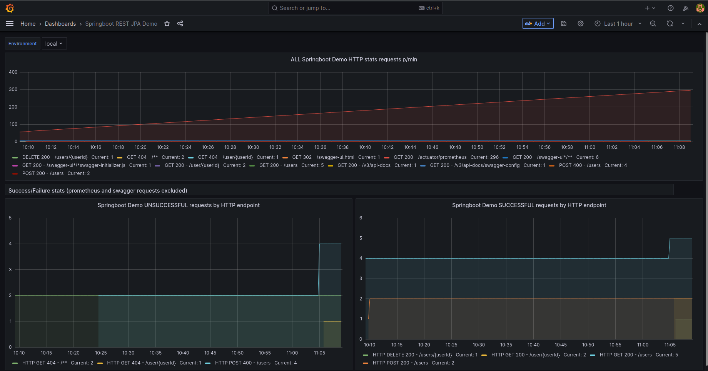

# springboot 3 rest/jpa/prometheus/grafana demo

### overview
This demo repository contains a springboot 3 maven project which

* exposes a Spring MVC REST API to maintain a 'user' object
* uses an in-memory version of an H2 database to store the data received over the REST API, using
  * JPA annotations
  * Spring Data
* metrics exposed by the micrometer libraries are collected by a configured prometheus DB  
* exposes swagger/open-api interface information - once started, see [here](http://localhost:8080/swagger-ui.html)

### development environment: <a name="environment"></a>
This code was developed and tested on:
```agsl
* Linux 5.15.0-71-generic #78-Ubuntu x86_64 GNU/Linux
* OpenJDK Runtime Environment (build 17.0.6+10-Ubuntu-0ubuntu122.04)
```

### docker-compose
The docker-compose.yml file contains configuration for
* starting a prometheus DB docker container
* starting a grafana docker container which is configured to 
  * expose metrics for collection by prometheus
  * expose a default dashboard of metrics from the demo springboot application
* starting the demo springboot project

It will start all containers locally. The springboot app contains default connectivity to grafana

The grafana dashboard can be viewed, once started, see [here](http://localhost:3000)

### to see the demo ......
* you'll need docker/docker-compose installed locally - you'll have to check that out yourself ..
* clone this repository to your local disk
* build the springboot demo. If you want to do this yourself, you'll need java 17 installed, and if not using the maven wrapper mvnw mentioned below, a local install of maven
  * on the command line in the root directory (i.e. the same directory as the 'pom.xml' file), type
```agsl
./mvnw clean install
```
* once the build finishes, there should be a file 'spring-boot-rest-jpa-prometheus-demo-0.0.1-SNAPSHOT.jar' visible in the target directory
* on the command line in the root directory (i.e. the same directory as the 'docker-compose.yml' file), type
```agsl
docker-compose build
```
* this instruction prepares the docker containers necessary to run the demo
* when this instruction is complete, type:
```agsl
docker-compose up
```
* this should start all of the necessary containers

Once all containers are running, you can proceed to add some data over the demo REST API
* click [here](http://localhost:8080/swagger-ui.html) to access and use the Open API documentation to add some data 
  * Add some data:
    * Find the POST /users option and select 'Try it out'
    * Click on the 'Execute' button a few times
  * Query the data you've just added
    * Find the GET /users option and click 'Try it out'
    * Click on the 'Execute' button a few times
* This activity will now be visible in grafana, having been stored in the prometheus DB
  * click [here](http://localhost:3000) and then find and click on the springboot-demo dashboard
* Err ... that's it

### tests and code coverage
The project is also configured to produce code coverage data using the jacoco maven plugin.
After a build, this information can be found here: target/site/jacoco/index.html

### Sonar
Sonar can be built stand-alone as detailed below if you have access to an instance.
NB You'll need to update the 'sonar' properties in the pom.xml file to identify the host and login token to be used when sending analysis to sonar.

```$xslt
mvn clean org.jacoco:jacoco-maven-plugin:prepare-agent install
mvn sonar:sonar
```

### Prometheus/Grafana
Unlike InfluxDB, to which data is sent by the micrometer libraries, prometheus by default scrapes metrics from a page exposed (in this case at http://localhost:8080/actuator/prometheus) by the micrometer libraries.
Grafana is configured to use prometheus as a datasource and display those metrics in a graphic form.
Note that in grafana we are making use of a default dashboard made available at:
```agsl
https://grafana.com/grafana/dashboards/4701%22
```
prometheus configuration can be checked once the container is up, at:
```agsl
http://localhost:9090/targets?search=
```
Individual metrics can be viewed directly in prometheus, for instance:
```agsl
http://localhost:9090/graph?g0.expr=jvm_classes_loaded_classes&g0.tab=0&g0.stacked=0&g0.show_exemplars=0&g0.range_input=1h
```
## Example Grafana metrics after REST API activity
